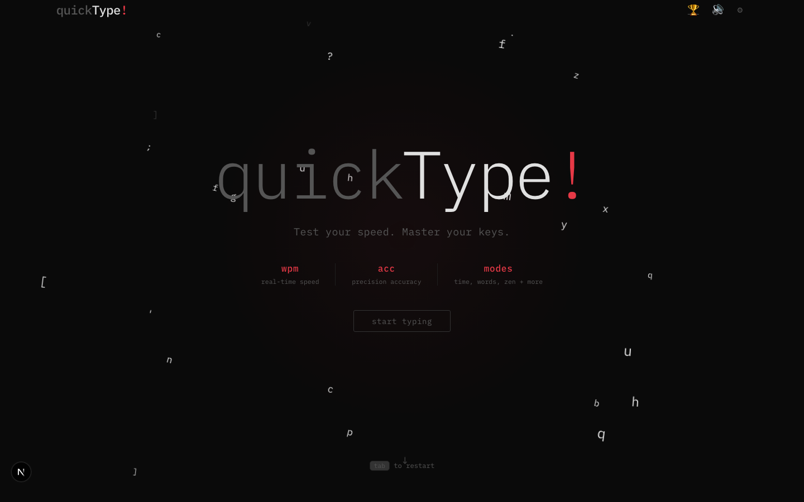
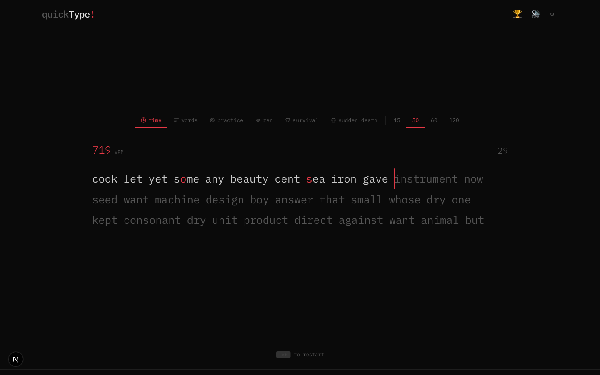
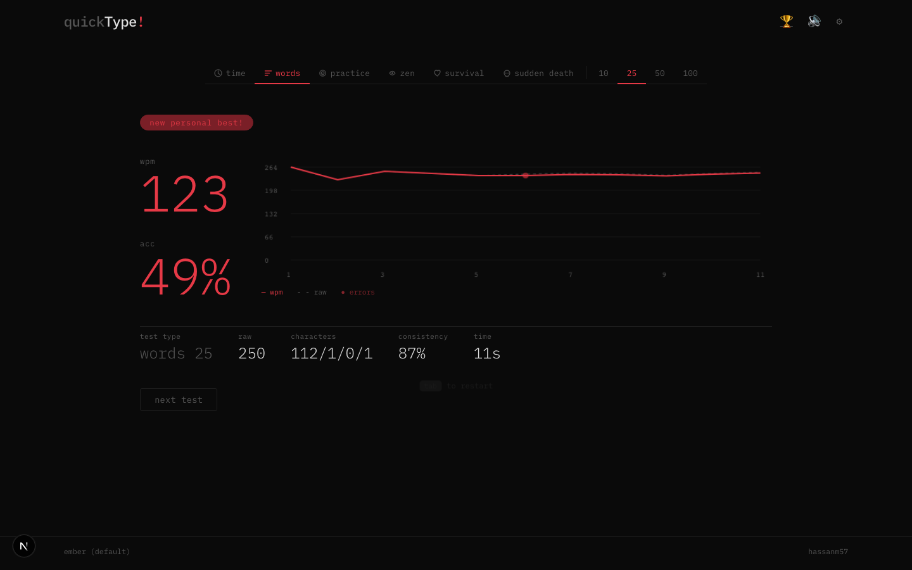
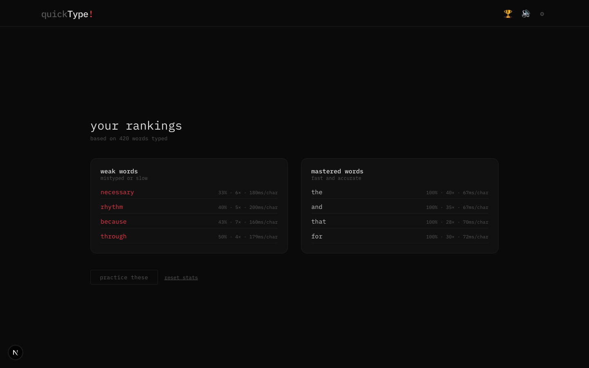
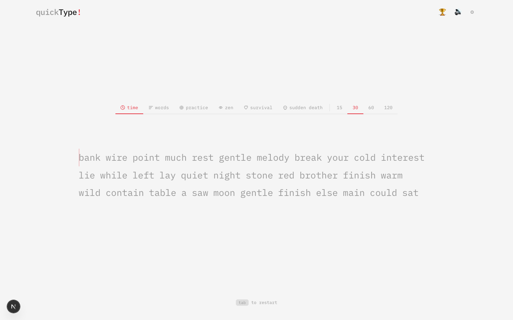
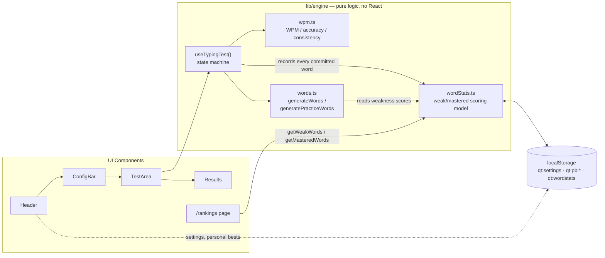

<div align="center">

# quickType!

**A minimalist, monkeytype-inspired typing speed test — with an adaptive practice engine that learns your weaknesses.**

[](https://nextjs.org/)
[](https://react.dev/)
[](https://www.typescriptlang.org/)
[](https://tailwindcss.com/)
[](https://playwright.dev/)
[](#architecture)

[](https://vercel.com/new/clone?repository-url=https://github.com/hassanm57/quickType-typingGame-javaScript)



</div>

## Overview

**quickType!** is a fast, keyboard-first typing test built with the Next.js App Router. It covers the fundamentals you'd expect from a polished typing test — live WPM/accuracy, six test modes, five themes, per-second stat sampling, a smooth GPU-accelerated caret — and then goes a step further with a **from-scratch adaptive practice engine**: the app quietly tracks which specific words and characters you mistype or type slowly, and uses that history to generate practice sessions that target your actual weak spots, plus a rankings page that visualizes your weakest and most-mastered words.

There is no backend, no database, and no account system. Every byte of personalization lives in `localStorage` on your machine — the app is a static, fully client-rendered experience that happens to feel like it "knows" you.

## Table of Contents

- [Features](#features)
- [Screenshots](#screenshots)
- [The Adaptive Practice Engine](#the-adaptive-practice-engine)
- [Tech Stack](#tech-stack)
- [Architecture](#architecture)
- [Getting Started](#getting-started)
- [Testing](#testing)
- [Design Notes](#design-notes)
- [Roadmap](#roadmap)
- [Author](#author)

## Features

**Test modes**
- **Time** — race the clock (15 / 30 / 60 / 120s)
- **Words** — fixed-length sprints (10 / 25 / 50 / 100 words)
- **Practice** — an ML-lite adaptive mode that weights word selection toward your recorded weak spots, with an automatic cold-start fallback to plain random words until there's enough history to personalize
- **Zen** — untimed, unlimited, no pressure
- **Survival** — the clock only ever runs out if you stop typing correctly (+10s every 5 words)
- **Sudden Death** — one mistake ends the test

**Adaptive learning**
- Every word you type, in every mode, silently feeds a per-word and per-character performance model (attempts, errors, timing)
- The **Practice** mode consumes that model to bias word generation toward your actual mistakes — not just "hard words," *your* words
- A dedicated **Rankings** page (`/rankings`) surfaces your weakest and most-mastered words, with a one-click reset

**Live feedback**
- Real-time WPM using a 5-second trailing window (not a lifetime average) so the number reflects your *current* pace, not where you started
- Live accuracy, countdown/elapsed/words-remaining depending on mode
- Per-character correctness highlighting, extra/missed character tracking, and a smoothly animated caret that slides via CSS transforms (no layout thrashing)
- End-of-test breakdown: WPM, raw WPM, accuracy, consistency (derived from per-second WPM variance), full character breakdown, and a per-second WPM/error chart
- Personal-best tracking, scoped per mode + amount

**Polish**
- 5 built-in themes (ember, midnight, mint, serika, light), switchable live with CSS custom properties — no reload
- Keystroke sound effects with an animated mute/unmute toggle
- Tab-to-restart with a smooth fade-out/fade-in transition
- Fully responsive, keyboard-driven, animated hero landing section

## Screenshots

<table>
<tr>
<td width="50%">

**Live typing, real-time accuracy**

</td>
<td width="50%">

**End-of-test breakdown + WPM chart**

</td>
</tr>
<tr>
<td width="50%">

**Rankings — weak words vs. mastered words**

</td>
<td width="50%">

**Live theme switching (5 built-in themes)**

</td>
</tr>
</table>

## The Adaptive Practice Engine

The interesting engineering problem here: how do you make a typing test "learn" a user's weaknesses using nothing but the browser — no server, no database, no ML runtime — while keeping the model honest, explainable, and cheap to compute on every keystroke?

**The approach** (`lib/engine/wordStats.ts`) is a small, fully transparent content-based scoring model, not a black box:

```
weakness(word) = 0.5 · wordErrorRate  +  0.35 · charErrorRate  +  0.15 · relativeSpeed
```

- **`wordErrorRate`** — the word's own historical error rate, confidence-scaled by how many times it's actually been typed (a single unlucky miss won't dominate the score)
- **`charErrorRate`** — the mean error rate of the word's *individual letters*, independently confidence-scaled. This is what lets a word the user has **never typed before** still score as "weak," if it's built from letters they consistently fumble
- **`relativeSpeed`** — the word's average ms/character measured against the user's own global average, so there's no hardcoded WPM threshold — it adapts to each user's baseline

`generatePracticeWords()` (`lib/engine/words.ts`) turns those scores into sampling weights (`1 + 9 × weakness`) over the ~700-word dictionary and draws from that distribution — every word stays reachable (so practice sessions don't degrade into looping the same five worst offenders), but genuinely weak words show up far more often. Below a **cold-start threshold** (30 lifetime word commits), the mode transparently falls back to plain random generation, so a brand-new user is never handed a broken, empty pool.

The same store powers `/rankings`: `getWeakWords()` / `getMasteredWords()` rank the tracked words by that same signal, with deliberately forgiving display thresholds (a word only needs one real mistake to appear as "weak," and two clean reps to count as "mastered") — a design correction made after testing showed that requiring 3+ repeats of the *same* word out of a 700-word dictionary left the rankings page empty for a very long time in realistic usage.

Everything is capped and pruned (`MAX_TRACKED_WORDS`) so the `localStorage` footprint stays trivially small indefinitely, with no server-side storage or PII ever leaving the browser.

## Tech Stack

| Layer | Choice | Why |
|---|---|---|
| Framework | [Next.js 16](https://nextjs.org/) (App Router) | File-based routing for `/` and `/rankings`, `next/font` optimization, zero-config builds |
| UI | [React 19](https://react.dev/) | Hooks-first, all client components (`"use client"`) — this is an interaction-heavy app, not a content site |
| Language | [TypeScript 5](https://www.typescriptlang.org/) (`strict` mode) | Full type coverage across the engine layer, components, and tests |
| Styling | [Tailwind CSS 4](https://tailwindcss.com/) + hand-written CSS custom properties | Theming via CSS variables swapped at runtime, not rebuilt Tailwind configs |
| Testing | [Playwright](https://playwright.dev/) | Full end-to-end coverage of every mode, the rankings page, and theming — see [Testing](#testing) |
| Persistence | Browser `localStorage` | Settings, personal bests, and the word-stats model — zero backend, zero database |
| Deployment | [Vercel](https://vercel.com/) | Zero-config Next.js hosting |

No state management library, no CSS-in-JS, no backend framework — the app is small enough that a couple of custom hooks and `localStorage` cover the entire feature set without extra dependencies.

## Architecture



The core design decision is a clean split between **engine** (`lib/engine/*`, `lib/*`) and **UI** (`components/*`, `app/*`): all typing-test state, scoring, and persistence logic is plain TypeScript with no JSX and no framework dependency, driven by a single hook — `useTypingTest(config)` — that every mode shares. Components are thin renderers over that hook's return value; `TestArea.tsx` in particular is fully mode-agnostic, it has no idea whether it's rendering a "time," "zen," or "practice" test.

```
.
├── app/
│   ├── page.tsx              # main test experience (hero, config bar, test/results)
│   ├── rankings/page.tsx     # weak/mastered word rankings
│   └── layout.tsx, globals.css
├── components/
│   ├── Header.tsx, Footer.tsx, HeroSection.tsx, ConfigBar.tsx, LoadingScreen.tsx
│   ├── TestArea/             # TestArea, LiveStats, Word
│   └── Results/              # Results, WpmChart
├── lib/
│   ├── engine/
│   │   ├── useTypingTest.ts  # the state machine — all 6 modes live here
│   │   ├── wpm.ts            # WPM / accuracy / consistency math, final-stats + chart samples
│   │   ├── words.ts          # random + weakness-weighted word generation
│   │   └── wordStats.ts      # the adaptive scoring model (see above)
│   ├── storage.ts            # settings + personal-best persistence
│   ├── useSettings.ts        # shared theme/sound hydration hook
│   └── themes.ts, sound.ts
├── data/words.ts              # ~700-word dictionary
└── tests/                     # Playwright end-to-end suite
```

## Getting Started

**Requirements:** Node.js 20+ and npm.

```bash
git clone https://github.com/hassanm57/quickType-typingGame-javaScript.git
cd quickType-typingGame-javaScript
npm install
npm run dev
```

Open [http://localhost:3000](http://localhost:3000). That's it — no environment variables, no database setup, no API keys.

```bash
npm run build   # production build
npm run start   # serve the production build
```

## Testing

The full user-facing behavior is covered end-to-end with Playwright — every mode's selectability, sub-options, completion flow, and mode-specific rules (sudden death ending on the first mistake, zen never ending, survival's countdown, etc.), plus the rankings page's empty state, seeded data rendering, and reset flow.

```bash
npx playwright test          # run the full suite headless
npx playwright test --ui     # interactive UI mode
```

## Design Notes

- **Dark by default, monospace throughout** — IBM Plex Mono via `next/font`, five swappable themes driven entirely by CSS custom properties (`--bg`, `--accent`, `--correct`, `--incorrect`, `--caret`, …), so switching themes is an instant style-variable swap with no re-render of the word list.
- **Animation is deliberate, not decorative** — the caret slides via `transform` (GPU-accelerated, no layout reflow), word transitions use short `cubic-bezier` easing, and every animation respects `prefers-reduced-motion`.
- **The live WPM meter uses a rolling window, not a lifetime average** — an earlier version divided total correct characters by total elapsed time, which meant a fast start could keep the number artificially high for the rest of a long test even after slowing down considerably. It now reflects the last 5 seconds of typing, so it tracks *current* pace.
- **No hydration flashes** — settings (theme, sound) are read from `localStorage` and applied before the app shell renders, shared between `/` and `/rankings` via a single `useSettings()` hook.

## Roadmap

Ideas that would extend the current architecture without needing a backend:

- Multi-language word dictionaries (code snippets, quotes, non-English text)
- Exportable/importable stats (so the "weak words" model isn't tied to one browser)
- A lightweight keystroke-rhythm visualization (dwell/flight time) built on the same per-character data already being collected

## Author

Built by **[Hassan Mansoor](https://github.com/hassanm57)**.
